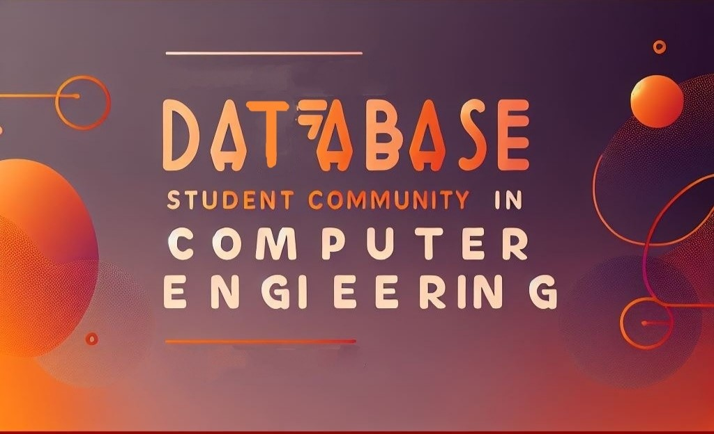

# DB-Students

## Acerca de Nosotros
DB-Students es una organización creada por estudiantes de ingeniería informática dedicada a la colaboración y aprendizaje en el campo de las bases de datos. Nuestro objetivo es compartir conocimientos, trabajar en proyectos conjuntos y mejorar nuestras habilidades en el manejo y administración de bases de datos.

## Objetivos
- Fomentar el aprendizaje y la práctica en el uso de diversas tecnologías de bases de datos.
- Colaborar en proyectos de código abierto relacionados con bases de datos.
- Organizar y participar en talleres, seminarios y sesiones de estudio.
- Compartir recursos educativos y mejores prácticas.

## Proyectos
Nuestros proyectos serán:
- **OpenSource**: Promovemos el uso de licencias abiertas para que cualquier persona pueda contribuir y beneficiarse.
- **Sin fines de lucro**: Todos nuestros esfuerzos están dirigidos a causar un impacto positivo sin buscar ganancias económicas.
- **Índole Educativo**: Nos enfocamos en proyectos que tengan un valor educativo significativo.
- **Impacto Positivo en la Comunidad**: Buscamos que nuestros proyectos beneficien a la comunidad en general.

Iremos trabajando poco a poco, avanzando a medida que aprendemos y colaboramos en nuevos proyectos.

## Contacto
Para más información o para unirte a nuestra organización, visita nuestro [repositorio](https://github.com/DB-Students) o contacta a uno de nuestros administradores.

## Badges

